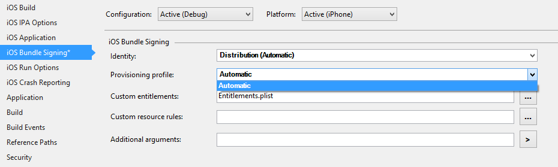
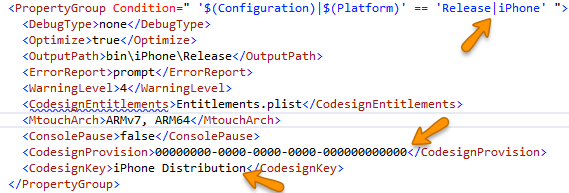

---
# 36117.md
summaryMarkdown: |
    Certain distribution provisioning profiles do not appear in the iOS project settings.

    

workaroundMarkdown: |
    **Possible temporary workaround**: The problem is limited to _browsing_ the provisioning profiles. If you set the desired "CodesignProvision" and "CodesignKey" using Xamarin Studio on Mac, the values will be preserved in the project file, and the app will be signed correctly when _building_ in Visual Studio on Windows. Similarly, if you set the desired provisioning profile on Mac, save the project, and then open the `.csproj` file in a text editor, you can find the `<CodesignProvision>` and `<CodesignKey>` elements, and then copy them into the corresponding location in the `.csproj` file on Windows.

    

# statusNotesMarkdown: ""

lastGoodVersion: "iOS 9.1 WatchKit Hotfix"
firstBadVersion: "Cycle 6"
# firstFixedVersion: ""

# fixedOn:
#     Stable: true
#     Beta: true
#     Alpha: true

tags:
    - "XamarinVS"
    - "iOS"

private: "true"
product: "Visual Studio Extensions"
version: "4.0 (C6)"
status: "RESOLVED FIXED"
opSys: "Windows"
priority: "High"
severity: "blocker"
targetMilestone: "4.0.1 (C6SR1)"
---
